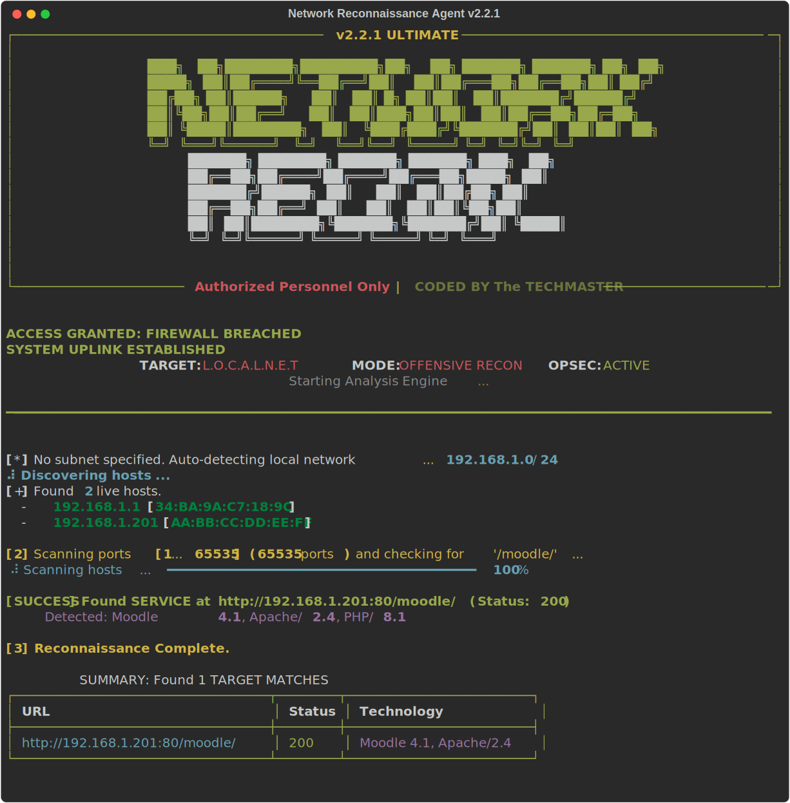

# 🕵️‍♂️ Network Reconnaissance Agent

> **Automated Network Discovery & Moodle Hunter**
>
> _Identify hosts, scan ports, fingerprint services, and discover hidden web applications with a single command._


---

## 🚀 Overview

**Network Reconnaissance Agent** is a specialized, lightweight network scanner designed for rapid environment assessment. Originally built to hunt for **Moodle** exam servers in local subnets, it has evolved into a general-purpose reconnaissance tool capable of:

- **Auto-detecting** local network ranges.
- **Identifying** live hosts and their vendors (via MAC address).
- **Fingerprinting** web technologies (Apache, IIS, PHP, Moodle).
- **Brute-forcing** common admin paths.

It is the perfect tool for when you plug into a new network and need to answer: _"Where is the server?"_

## ✨ Key Features

**v2.2.1 Updates**:

- **⚡ ARP Scanning**: Extremely fast local network discovery using ARP requests (fallback to Ping for remote).
- **🎨 Visual Overhaul**: New **Matrix Rain** startup code and beautiful **Rich** progress bars.
- **🔢 Port Ranges**: Support for custom ranges (e.g., `--ports 100-200`) and `--all-ports` scanning.
- **🕸️ Advanced Web Enum**: Auto-detects **Moodle**, **WordPress**, **Canvas**, **Blackboard** and extracts **versions**.

- **🧠 Smart Auto-Discovery**: No need to type IP ranges. The agent detects your subnet (`/24`) automatically.
- **🔍 Deep Service Fingerprinting**: Goes beyond port checking. It analyzes HTTP headers and HTML content to identify:
  - **CMS**: Moodle, WordPress, etc.
  - **Server**: Apache, Nginx, IIS.
  - **Lang**: PHP, ASP.NET.
- **📡 Host & Vendor Identification**: Resolves MAC addresses to manufactures (e.g., _Raspberry Pi_, _TP-Link_, _Dell_).
- **🛡️ Resilience**:
  - **Multi-Path Fallback**: If `/moodle/` is 404, it checks `/`, `/admin/`, `/login/`, `/wp-login.php`, etc. automatically.
  - **SSL/TLS**: Automatically handles self-signed certificates.

## 🛠️ Installation

1.  **Clone the Repository**

    ```bash
    git clone https://github.com/Hao-Tec/NetworkReconAgent.git
    cd NetworkReconAgent
    ```

2.  **Set up Virtual Environment**

    ```bash
    python -m venv .venv
    # Windows
    .venv\Scripts\activate
    # Linux/Mac
    source .venv/bin/activate
    ```

3.  **Install Dependencies**
    _Requires `scapy` and `psutil` now._
    ```bash
    pip install -r requirements.txt
    ```

## 💻 Usage

### 🟢 Zero-Config Scan (Recommended)

Simply run the script. It will detect your network and hunt for Moodle by default.

```bash
python main.py
```

### 🎯 Targeted Scan & Ranges

Search for a specific path on a specific subnet, scanning a range of ports.

```bash
python main.py --subnet 192.168.1.0/24 --ports 80,443,8000-8100
```

### ⚙️ All Ports

Scan 1-65535 (Warning: Slow).

```bash
python main.py --all-ports
```

## 📊 Sample Output



## 🤝 Contributing

Contributions are welcome! Please open an issue or submit a pull request.

## 📄 License

Destributed under the MIT License. See `LICENSE` for more information.
